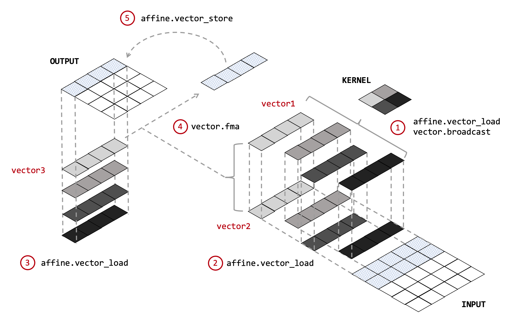

# Buddy MLIR  
This project is an outstanding learning materials for MLIR learning. All its dialect can be categorized into three aspects:  
1. RVV: risc-v with vector
2. Gemmini: a configurable matrix multiplication accelerator, specifically for RISC-V.
3. graph processing: dsl dialects

## Learn by examples  
In `/examples` categories, contain all sorts for examples to help fully understand Buddy mlir project. Currently, the author provide **three types of examples.**
* IR level conversion and transformation examples.
* Domain-specific application level examples.
* Testing and demonstrating examples.

## Conv-opt tools
To start with, i choose to learn how to write conv-opt optimization tools, cause it only contains matrix conv and matters like that.  
> Caution:   
> If we git checkout to the initial Conv-opt tools, we may fail to build the project. LLVM version has changed a lot and author has rewriten the old version code.    
> Another issue is that conv-opt is actually deleted in the origin repo, or being used as the base toolbox. So i'will try to rewrite it in my toy project to fulfill the same results.

## Gemmini

## References 
1. [Buddy mlir论文](https://www.researchgate.net/publication/371191540_Compiler_Technologies_in_Deep_Learning_Co-Design_A_Survey)
2. [Buddy mlir github](git@github.com:buddy-compiler/buddy-mlir.git)