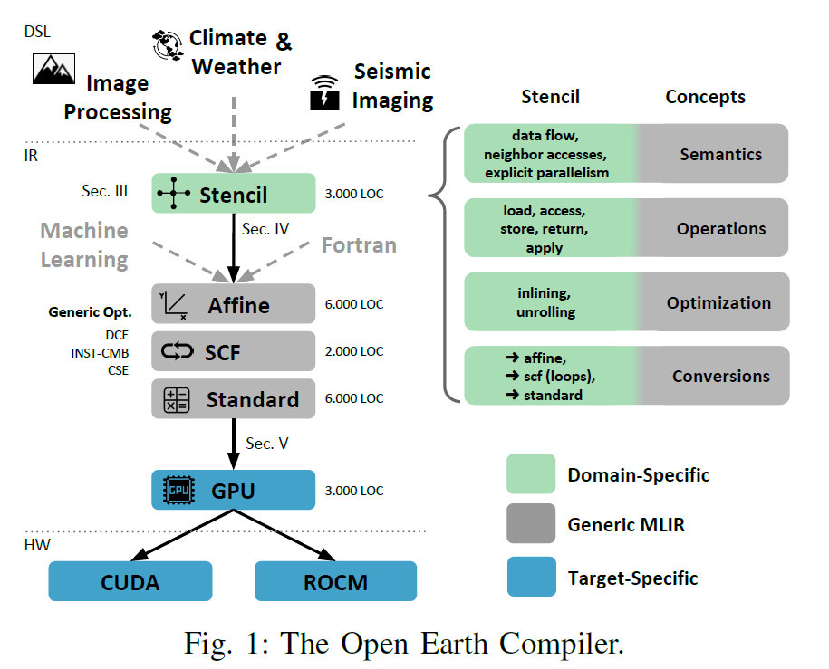
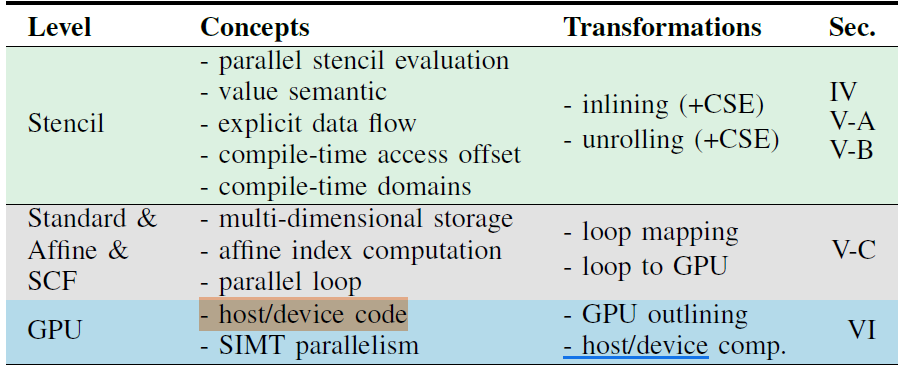

# The Open Earth Compiler
## Why read this Essay
**Intro**: This essay takes climate modeling and image processing as two case studies, to show how to write domain-specific compiler for DSL **with the help of MLIR.**    
  
From the main framework shown above, we can see that this project involves three levels of dailect: 
* Stencil for professional image processing 
* Affine, SCF and Standard dialects to bridge the gap and introduce optimization in different levels of abstraction.  
* GPU dialect, support both CUDA and ROCM    

**My focus**: To me, my focus is on second layer and third layer. Learning how to lower a certain language to cuda or rocm is my focus.  

## Key note of the essay
### Three Design Principles
* Transformation-Driven Semantics
* Progressive Lowering
* Explicit Separation    

## References
1. [Domain Specific Rewrite](https://arxiv.org/abs/2005.13014)