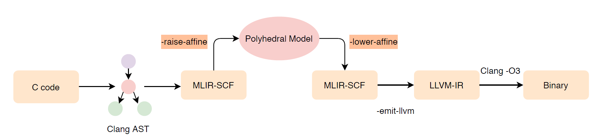

# Polygeist 
## Overall Stucture 
  
The Whole project can be divided into three components:  
* C/C++ to MLIR IR front end part
* raise-affine to **PolyhedralModel** and then lower-affine to mlir-scf IR part, which is the **core part** of the whole pipeline. 
* codegen to llvm-ir and to binary(Cuda is optional).  

### Main features  
The most outstanding feature is the reuse of existing mature and state of art infrastructure.  
* In front end：**Polygeist leverages Clang infrastructure to perform syntactic
and semantic analysis of the input code.** Conver c/c++ code to MLIR SCF dialect or standard dialect.  
* 
