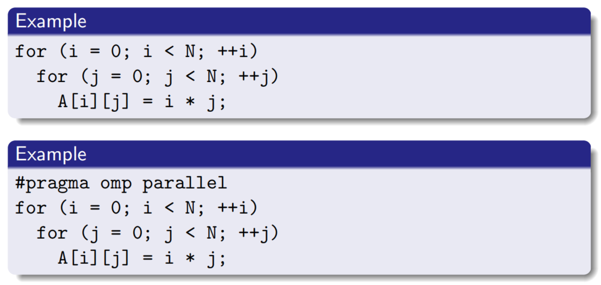
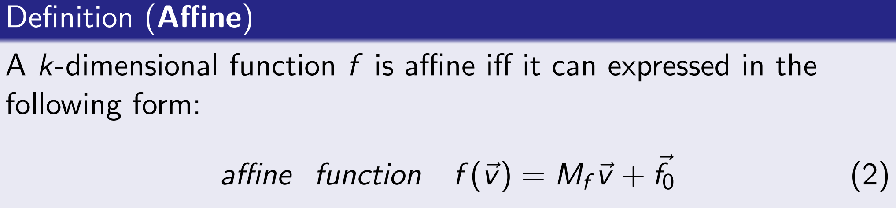
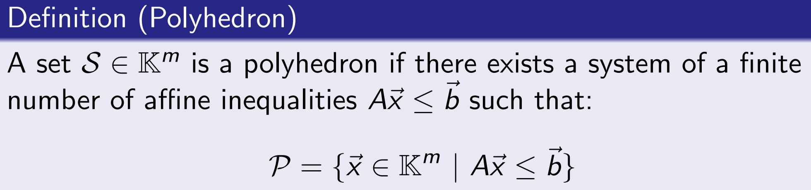
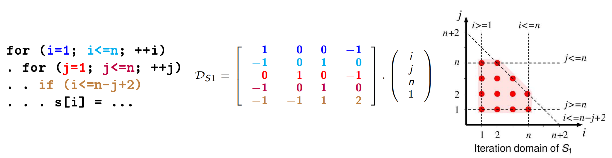
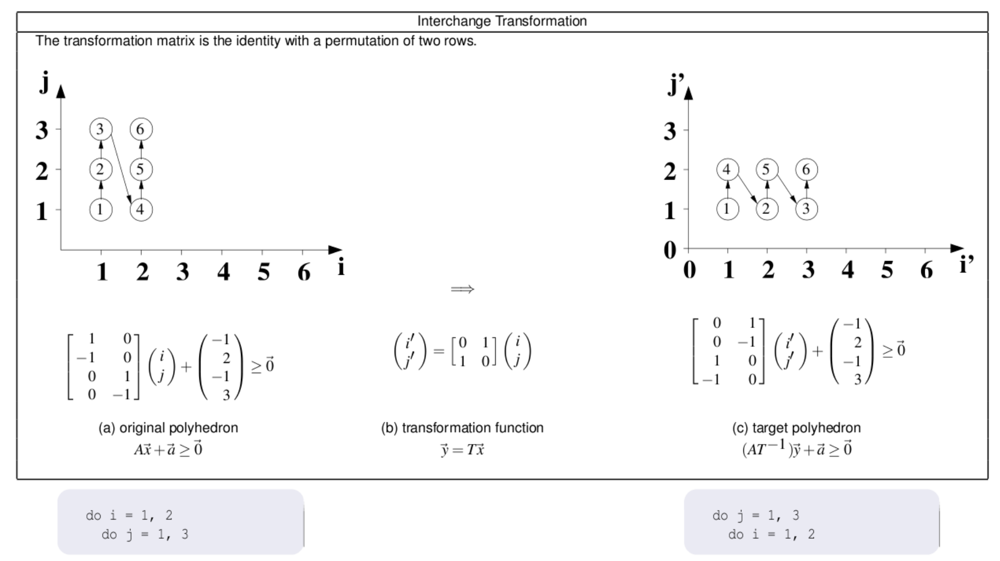
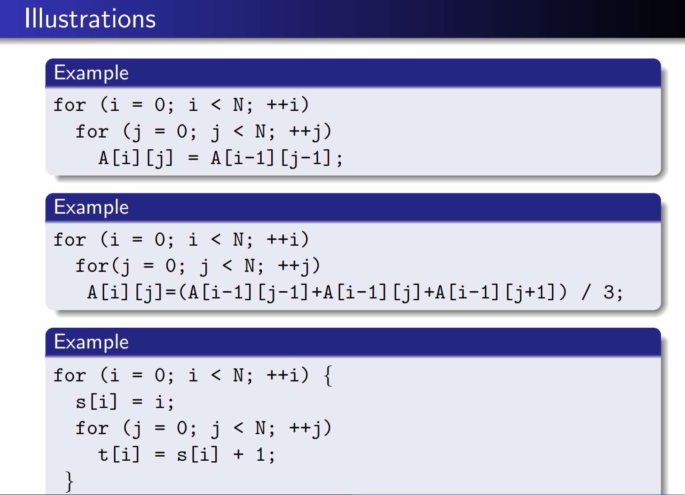
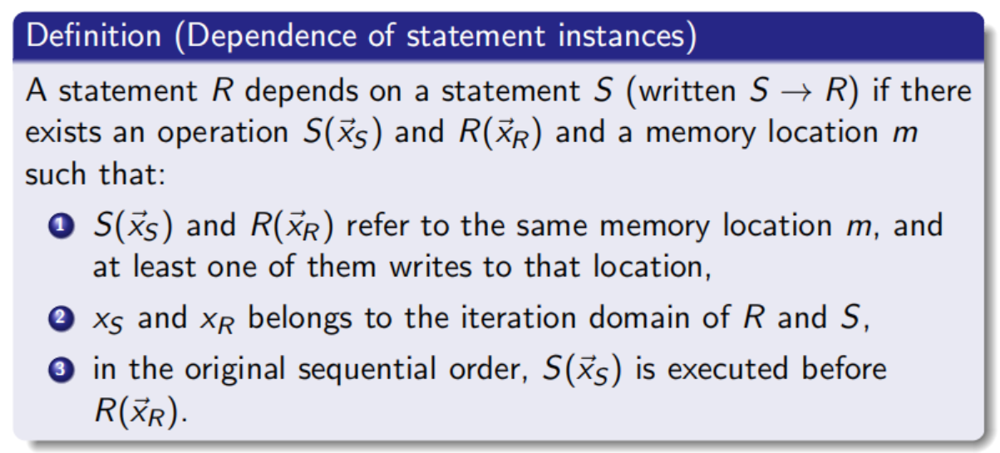
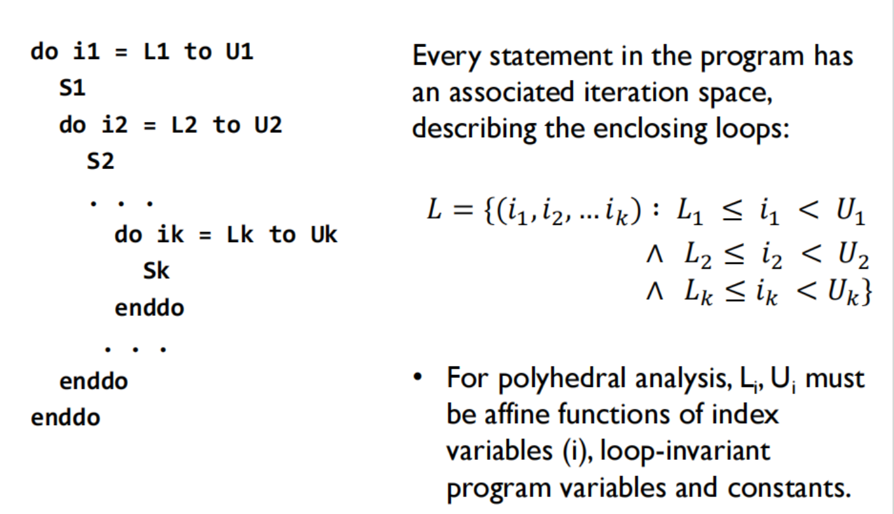
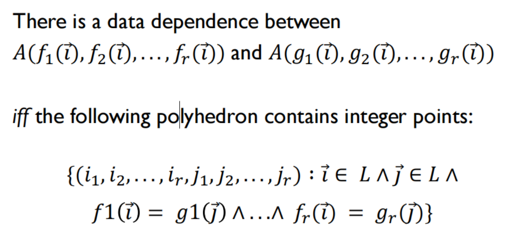
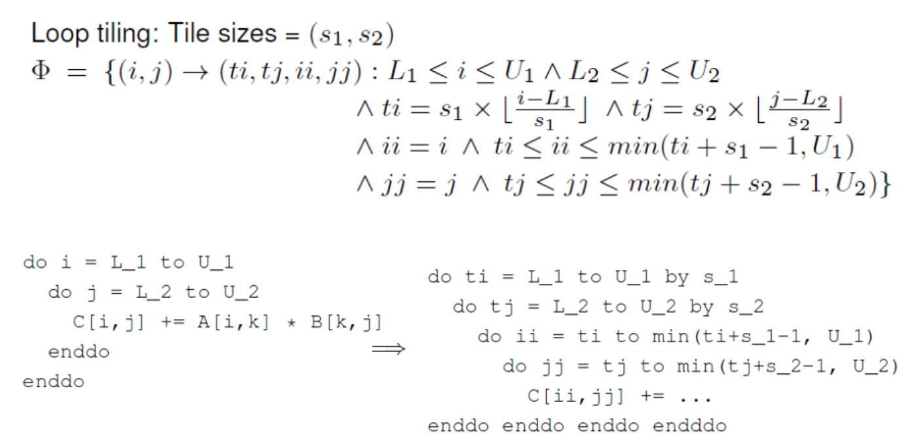

# Polyhedraon Matters
## Why Polyhedral Model?
Parallel matters, and **Loop** contains the most Parallel points in a code. So a method to find parallelism in loop is inneed.  
Polyhedral 
> Model is a mathematical, high level IR of
program, which helps in reasoning about parallelism

## Properties of Polyhedral
* Loop index must be maintained
* Loop iteration number must be maintained
* index order must be maintained

### Basic Concepts
`Affine`

`Polyhedron`

### How polyhedral represent Loop
The Loop code below can be interpreted as:  

A more easy example to understand:  

### Invalid Loop  

> Given two iterations, there exists a dependence between them if
the following conditions are met:
> 1. they reference the same memory location
> 2. one of the accesses is a write

Some Terminology on Dependence Relations  
* Uniform dependences: the **distance between two dependent iterations is a constant**  
* Non-uniform dependences: the distance between two dependent iterations **varies along the execution**  
* Parametric dependences: at least a **parameter** is involved in the dependence relation

## How to find Dependence?  
> The answer lies in the concept: 
> **Dependence polyhedron**, list of sets of
dependent instances, with a set of dependence polyhedra for
each pair of statements  

This concept actually is quite apparent to us, but How to present it in Polyhedral form is a quesiton.   
Let's first see the basic definition:  

### Three states of Transformation
* A Transformation is illegal if a dependence crosses the
hyperplane backwards
* A dependence going in forward direction between two
hyperplanes **indicates sequentiality**
* No dependence between any point of the hyperplane indicates
**parallelism**

### Polyhedral Static Analysis  
**Three concepts**
1. Loops have affine control only (over-approximation otherwise)
2. Iteration domain: represented as integer polyhedra
3. Affine schedule: represented as Affine function
4. Memory accesses: static references, represented as affine
functions

## Poly Compiler
Polyhedral Analysis is a well-known and widely-used analysis and transformation pass, can be found in all sorts of compiler framework like llvm and mlir. The Step to apply Polyhedral Analysis can be concluded in the following steps:  
### Step1: Extract model from the code
The main goal is to find the **Associate iteration space** in codes. Every array reference in the program is a mapping from the iteration space to array elements.

### Step2: Dependence analysis 

### Step3: Transformations  

## Resources  
1. [Poly的数学基础](https://events.csa.iisc.ac.in/summerschool2013/slides/automatic-parallelization-introduction-polyhedral-models.pdf)
2. [Poly Compiler Lecture UIUC](http://polyhedral.info/)
3. [Poly implement blog from Cornell](https://www.cs.cornell.edu/courses/cs6120/2023fa/blog/polyhedral/)
4. [Compiler poly课程](https://www.youtube.com/watch?v=mt6pIpt5Wk0&t=2319s)

