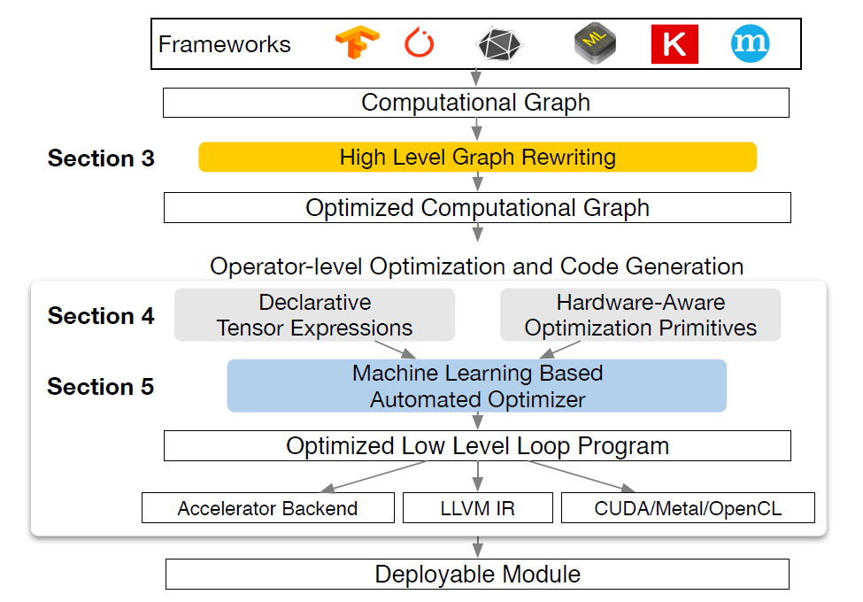

# TVM 
## Summary 
With the developement of machine learning framework such as PyTorch, TensorFlow and mxnet, deep learning becomes popular. But the need to bing deep learning framework to various backend hardwares also increases.   
The difficulty lies in: **we both need to optimize a piece of code at the high level computation graph and low level hardware-specific operators.** TVM tries to produce a generic framework that supports lowering computation graph to all kinds of hardware, and enables optimization at different layers. 

## Main pipeline
