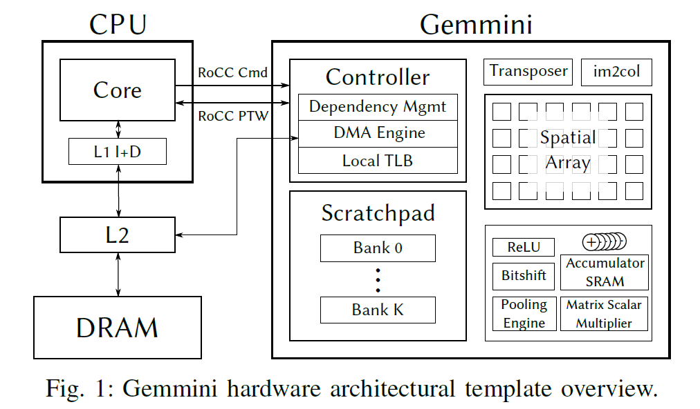
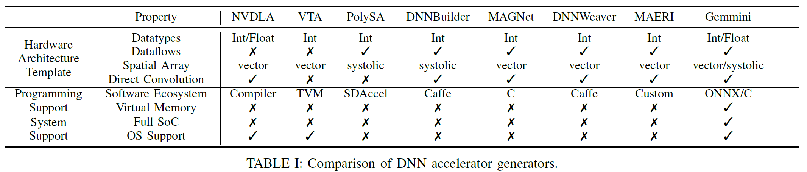

# Gemmini Reviews  

## Brief Summary  

* Full stack approach  
* co-design  
* evaluation
* a complete SoC integration

Different workers in different layer of machine learning system **hold various expectation on the system.**
## Strengths  
* Both fixed-point representation and floating point representation  
* multiple dataflow
* both vector and systolic spatial array architectures
* direct execution of different DNN
## Weaknesses  

## Improvement  

## Questions  
1. Why use Gemmini to co-design? Especially Virtual address translation system.
2. Why SoC integration with RISC-V arch and things like that matters.

## References  
1. [Paper](https://arxiv.org/abs/1911.09925)
2. [Github项目](https://github.com/ucb-bar/gemmini)
3. [Systolic Array](https://www.youtube.com/watch?v=XkgtANeDrm8)
